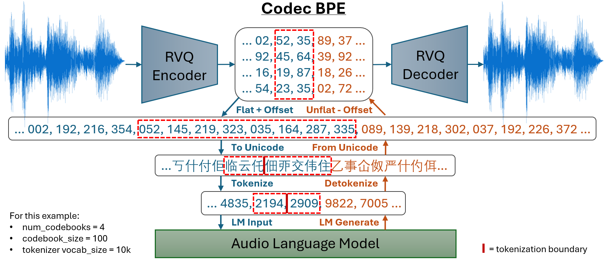

# codec-bpe


Codec BPE is an implementation of [Acoustic BPE](https://arxiv.org/abs/2310.14580) (Shen et al., 2024), extended for RVQ-based Neural Audio Codecs such as [EnCodec](https://github.com/facebookresearch/encodec) (Défossez et al., 2022), [DAC](https://github.com/descriptinc/descript-audio-codec) (Kumar et al., 2023), and [Mimi](https://huggingface.co/kyutai/mimi) (Défossez et al., 2024). Built on top of the [HuggingFace Tokenizers](https://github.com/huggingface/tokenizers) library.

Codec BPE flattens multi-level codes from Residual Vector Quantizers (RVQ) and converts them into unicode strings for tokenization into compressed token sequences. For example, a single Codec BPE token might represent a 4-gram of codes from 4 codebooks representing a single acoustic unit, a 6-gram comprising a whole acoustic unit and half of the next one, or even an 8-gram represnting two whole acoustic units. Depending on the codec, vocab size and type of audio, this can yield savings of 2-5x in sequence length compared to directly modeling the flattened codebooks.

**Using Codec BPE allows efficient audio language modeling with multi-level codecs to be done with vanilla LLM architectures, meaning no custom architecture is needed to deal with modeling the RVQ. Your model will already be compatible with the full ecosystem of training and inference tools available for [HuggingFace Transformers](https://github.com/huggingface/transformers), such as [vLLM](https://github.com/vllm-project/vllm)!**

## 🚀 Updates
**2024-09-20**

- Added support for Kyutai Lab's [Mimi codec](https://huggingface.co/kyutai/mimi), an amazing new codec with a 12.5 Hz framerate! Simply add `--use_mimi` when encoding audio with `codec_bpe.audio_to_codes` to encode using the Mimi model. More info [here](#train-a-tokenizer-from-audio-files).

    **Note:** Until Mimi is included in a stable release of HuggingFace Transformers, you need to install Transformers from source:
    ```bash
    pip install git+https://github.com/huggingface/transformers.git@main
    ```

**2024-09-19**

- Initial Release!

## Setup
```bash
pip install codec-bpe
```

## Usage

### Convert audio codes to and from unicode strings
Use your codec of choice (e.g., EnCodec, DAC, Mimi) to encode your audio into a torch tensor or numpy array of codes of shape (num_codebooks, length), then use the provided converter methods to convert to and from unicode strings.

**Note:** In the Acoustic BPE paper, a single-level codec was used (HuBERT + k-means), where each encoded timestep consisted of a single code which was converted to a single unicode character. Here, we support multi-level codecs based on Residual Vector Quantizers. If num_codebooks > 1, a flattening pattern is used to interleave all codebooks into a single level before mapping to unicode. For example, if 4 codebooks are used then each encoded timestep would consist of 4 codes (one from each codebook) and would be converted to a unicode 4-gram.

Example: audio language modeling using EnCodec 24 kHz at 3 kbps (4 codebooks):
```python
import torch
import librosa
import soundfile as sf
from transformers import (
    EncodecModel, 
    AutoModelForCausalLM,
    AutoProcessor, 
    AutoTokenizer,
)
from codec_bpe import codes_to_chars, chars_to_codes

# load a Codec BPE tokenizer and compatible language model
device = "cuda" if torch.cuda.is_available() else "cpu"
tokenizer = AutoTokenizer.from_pretrained("output/my_tokenizer")
model = AutoModelForCausalLM.from_pretrained("output/my_model").to(device)

# load the EnCodec model
encodec_modelname = "facebook/encodec_24khz"
encodec_model = EncodecModel.from_pretrained(encodec_modelname).to(device)
encodec_processor = AutoProcessor.from_pretrained(encodec_modelname)

# (1) encode audio using EnCodec
audio, sr = librosa.load("some_audio.mp3", sr=encodec_model.config.sampling_rate, mono=True)
inputs = encodec_processor(raw_audio=audio, sampling_rate=sr, return_tensors="pt").to(device)
with torch.no_grad():
    encoded_audio = encodec_model.encode(**inputs, bandwidth=3.0).audio_codes[0, 0]

# (2) convert the audio codes to a unicode string and tokenize it
unicode_str = codes_to_chars(encoded_audio, codebook_size=encodec_model.config.codebook_size)
inputs = tokenizer(unicode_str, return_tensors="pt").to(device)

# (3) generate tokens from the model
outputs = model.generate(**inputs, do_sample=True, max_new_tokens=300)

# (4) detokenize the output back into a unicode string and convert it back to audio codes
unicode_str_2 = tokenizer.decode(outputs[0], skip_special_tokens=False)
encoded_audio_2 = chars_to_codes(
    unicode_str_2, 
    num_codebooks=encoded_audio.shape[0], 
    codebook_size=encodec_model.config.codebook_size, 
    return_tensors="pt",
).to(device)

# (5) decode the generated audio using EnCodec
with torch.no_grad():
    audio_2 = encodec_model.decode(encoded_audio_2.unsqueeze(0).unsqueeze(0), [None]).audio_values[0, 0]
sf.write("some_audio_output.wav", audio_2.cpu().numpy(), sr)
```

### Train a tokenizer from audio files
To train a tokenizer from audio files:

1. Use your codec of choice (e.g., EnCodec, DAC, Mimi) to encode each audio file into a directory of numpy arrays (.npy files):
    ```bash
    # encode audio files using EnCodec 24 kHz at 3 kbps (4 codebooks)
    python -m codec_bpe.audio_to_codes \
        --audio_path path/to/audio \
        --encodec_model facebook/encodec_24khz \
        --bandwidth 3.0

    # encode audio files using first 4 codebooks of DAC 44kHz
    python -m codec_bpe.audio_to_codes \
        --audio_path path/to/audio \
        --dac_model 44khz \
        --n_quantizers 4 \
        --use_dac

    # encode audio files using first 6 codebooks of Mimi (24kHz)
    python -m codec_bpe.audio_to_codes \
        --audio_path path/to/audio \
        --mimi_model kyutai/mimi \
        --n_quantizers 6 \
        --use_mimi
    ```

2. Suppose you want to use the first 4 codebooks of [EnCodec 24 kHz](https://huggingface.co/facebook/encodec_24khz), run:
    ```bash
    python -m codec_bpe.train_tokenizer \
        --codes_path output/codes/encodec_24khz/mono \
        --num_codebooks 4 \
        --codebook_size 1024 \
        --codec_framerate 75 \
        --chunk_size_secs 30 \
        --vocab_size 30000 \
        --pad_token "<pad>" \
        --save_path output/my_tokenizer
    ```
    Here: 
    - `num_codebooks` specifies how many codebooks should be used (in a flattened pattern) when converting each timestep to unicode. For example, EnCodec 24kHz uses 2 codebooks at 1.5 kbps, 4 codebooks at 3 kbps, 8 codebooks at 6 kbps, etc. Note: when encoding the audio files, you should use at least as many codebooks as you plan to specify here.
    - `codebook_size` specifies the size of the codebook. EnCodec 24 kHz uses a codebook size of 1024.
    - `codec_framerate` specifies the framerate (number of timesteps per second) of the codec. EnCodec 24 kHz generates 75 timesteps per second.
    - `chunk_size_secs` specifies the number of timesteps (in seconds) that get converted to unicode and returned to the underlying Tokenizers trainer at a time.
    - `vocab_size` specifies the number of tokens (including the base vocabulary of individual unicode characters) that you want your tokenizer to have. The base vocabulary size is `num_codebooks` x `codebook_size`. For example, the command above would yield a tokenizer with a base vocabulary of 4096 individual unicode character tokens, each representing a single code from a single codebook, and 25,904 merged "ngram" tokens.

    See [train_tokenizer.py](codec_bpe/train_tokenizer.py) for a complete list of supported arguments.

### Extend an existing Transformers PreTrainedTokenizer
You may want to train a new Codec BPE tokenizer and then export its trained vocabulary to an existing Transformers tokenizer. For example, extending the Llama3, Mistral, Qwen, etc. tokenizers for multimodal text-audio language modeling.

Suppose you have trained your Codec BPE tokenizer and saved it to `output/tokenizer.json` and you want to extend the Mistral-7B-v0.1 tokenizer with its vocabulary, run:
```bash
python -m codec_bpe.extend_tokenizer \
    --existing_tokenizer mistralai/Mistral-7B-v0.1 \
    --codec_bpe_tokenizer output/my_tokenizer \
    --audio_start_token "<audio>" \ # optional
    --audio_end_token "</audio>"    # optional
```
This will simply add every token in `output/tokenizer.json` to the `mistralai/Mistral-7B-v0.1` tokenizer as a special token and save a copy of the latter. 

#### Avoiding vocabulary conflicts
If the added Codec BPE unicode tokens would conflict with existing tokens in the vocabulary, there are two options to mitigate this:

1. Override the default unicode offset using the `unicode_offset` argument for both `codec_bpe.train_tokenizer` and `codec_bpe.extend_tokenizer`. By default, unicode characters from the [CJK Unified Ideographs](https://symbl.cc/en/unicode-table/#cjk-unified-ideographs) block are used, following the Acoustic BPE paper. You can set `unicode_offset` to a different value to use a different unicode block that doesn't conflict with your existing vocabulary.

2. Use the `use_special_token_format` argument for `codec_bpe.extend_tokenizer`. This wraps each unicode character in each ngram with <>. For example, the 4-gram token "一刁嘂娃" would be converted to a token containing the string "\<一>\<刁>\<嘂>\<娃>". This format is more verbose, but should virtually eliminate the possibility of a vocabulary conflict:
    ```bash
    python -m codec_bpe.extend_tokenizer \
        --existing_tokenizer mistralai/Mistral-7B-v0.1 \
        --codec_bpe_tokenizer output/my_tokenizer \
        --audio_start_token "<audio>" \ # optional
        --audio_end_token "</audio>" \  # optional
        --use_special_token_format
    ```
    Then when preparing audio for tokenization with the extended tokenizer, you can pass the same argument to the `codes_to_chars` function:
    ```python
    # convert codes to unicode string
    unicode_str = codes_to_chars(encoded_audio, codebook_size=model.config.codebook_size, use_special_token_format=True)
    ```
    It is unnecessary to pass this argument to `chars_to_codes` - it will automatically detect and remove the special token format before converting back to codes.